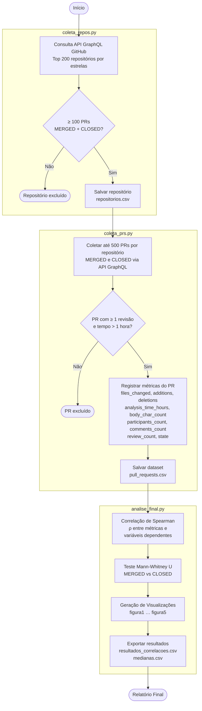
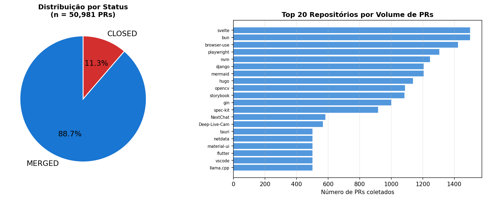
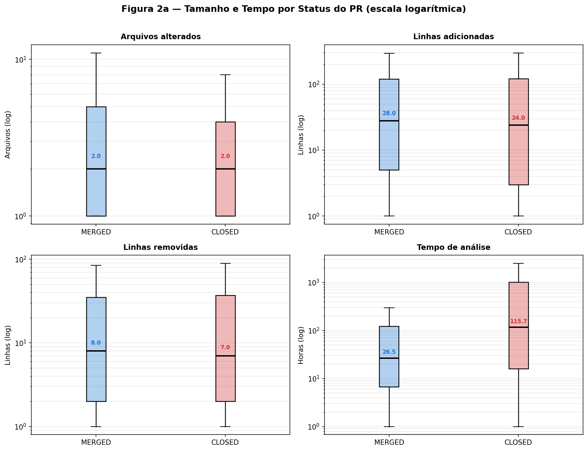
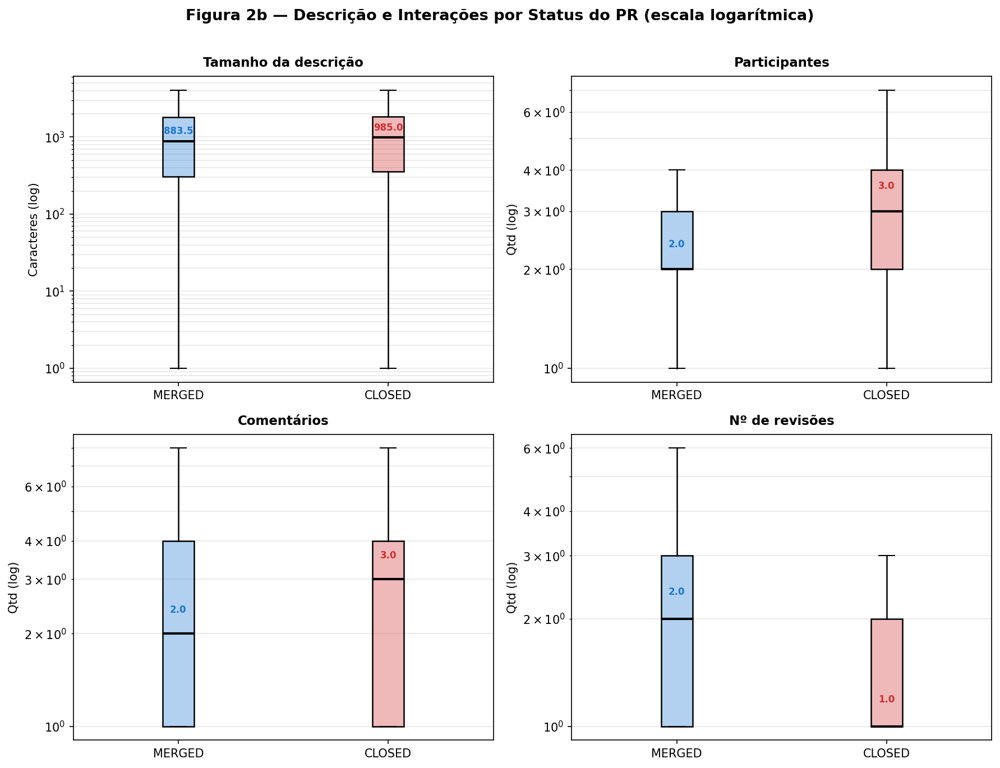
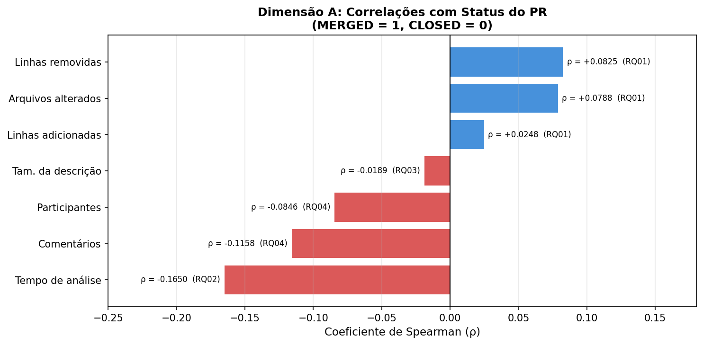
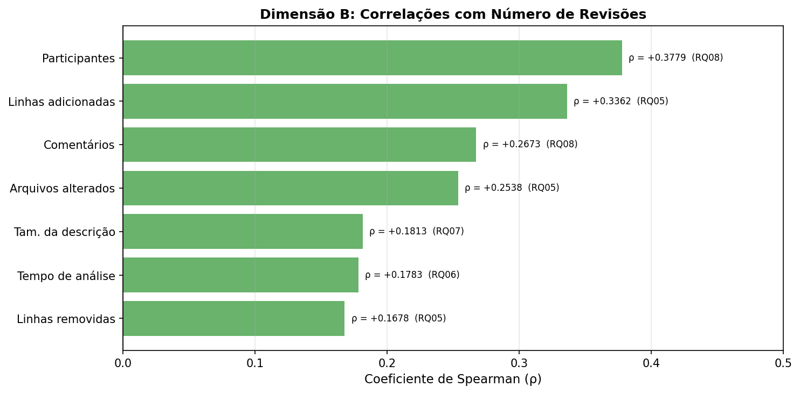
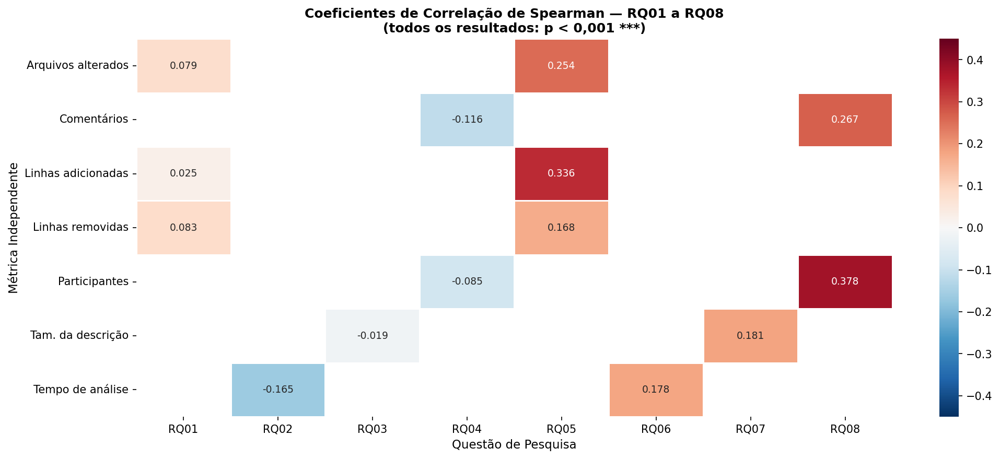

# Lab 03 - Code Review em Repositórios Open Source
## Relatório Final - Sprint 03

**Disciplina:** Laboratório de Experimentação de Software  
**Curso:** Engenharia de Software - PUC Minas  
**Autores:** Lucas Maia, Leandro Caldas  
**Data:** Maio de 2026

---

## Índice

1. [Introdução e Hipóteses](#1-introdução-e-hipóteses)
2. [Questões de Pesquisa](#2-questões-de-pesquisa-objetivos)
3. [Metodologia](#3-metodologia)
4. [Caracterização dos Dados](#4-caracterização-dos-dados)
5. [Resultados Obtidos](#5-resultados-obtidos)
6. [Discussão das Hipóteses](#6-discussão-das-hipóteses)
7. [Tomada de Decisão](#7-tomada-de-decisão)
8. [Conclusão](#8-conclusão)

---

## 1. Introdução e Hipóteses

O *code review* é uma prática central no desenvolvimento de software moderno, especialmente em projetos open source hospedados no GitHub. Por meio de *Pull Requests* (PRs), colaboradores propõem mudanças que passam por um processo de revisão antes de serem integradas ao repositório. O desfecho desse processo - PR aceito (`MERGED`) ou rejeitado (`CLOSED`) - e a intensidade do ciclo de revisões são influenciados por múltiplos fatores relacionados ao tamanho da contribuição, ao tempo de análise, à qualidade da descrição e ao nível de engajamento da comunidade.

Compreender esses fatores tem valor prático direto: permite que autores submetam contribuições com maior chance de aceitação e que mantenedores de projetos ajustem seus processos de revisão. Este estudo analisa **50.981 PRs de 191 repositórios populares do GitHub** para identificar correlações entre características dos PRs e seus desfechos.

### 1.1 Hipóteses Iniciais

A tabela a seguir apresenta as hipóteses informais formuladas antes da análise dos dados, com base no raciocínio teórico sobre o processo de code review:

| RQ   | Pergunta (resumida)           | Hipótese inicial |
|------|-------------------------------|-----------------|
| RQ01 | Tamanho × status              | PRs menores têm maior chance de serem aceitos. Revisores tendem a rejeitar contribuições volumosas por serem mais custosas de avaliar. **Correlação negativa esperada.** |
| RQ02 | Tempo × status                | PRs abertos por mais tempo acumulam conflitos ou perdem relevância. **Correlação negativa esperada** (mais tempo → mais chance de CLOSED). |
| RQ03 | Descrição × status            | Descrições detalhadas demonstram cuidado do autor e facilitam a revisão, aumentando a aceitação. **Correlação positiva esperada.** |
| RQ04 | Interações × status           | Engajamento costuma indicar relevância da contribuição. **Leve correlação positiva esperada.** |
| RQ05 | Tamanho × revisões            | PRs maiores exigem mais idas e vindas. **Correlação positiva esperada.** |
| RQ06 | Tempo × revisões              | Mais ciclos de revisão prolongam o tempo de análise. **Correlação positiva esperada.** |
| RQ07 | Descrição × revisões          | Uma descrição completa reduz dúvidas e diminui revisões necessárias. **Correlação negativa fraca esperada.** |
| RQ08 | Interações × revisões         | Mais participantes e comentários co-ocorrem com mais ciclos de revisão. **Correlação positiva forte esperada.** |

---

## 2. Questões de Pesquisa (Objetivos)

O estudo está organizado em duas dimensões de análise, cada uma com quatro questões de pesquisa:

### Dimensão A - Feedback Final das Revisões (Status do PR)

> **RQ01.** Qual a relação entre o **tamanho** dos PRs e o feedback final das revisões?

> **RQ02.** Qual a relação entre o **tempo de análise** dos PRs e o feedback final das revisões?

> **RQ03.** Qual a relação entre a **descrição** dos PRs e o feedback final das revisões?

> **RQ04.** Qual a relação entre as **interações** nos PRs e o feedback final das revisões?

### Dimensão B - Número de Revisões

> **RQ05.** Qual a relação entre o **tamanho** dos PRs e o número de revisões realizadas?

> **RQ06.** Qual a relação entre o **tempo de análise** dos PRs e o número de revisões realizadas?

> **RQ07.** Qual a relação entre a **descrição** dos PRs e o número de revisões realizadas?

> **RQ08.** Qual a relação entre as **interações** nos PRs e o número de revisões realizadas?

---

## 3. Metodologia

### 3.1 Fluxo do Processo

O diagrama abaixo resume as etapas executadas desde a coleta dos dados até a geração dos resultados:

### 3.2 Seleção de Repositórios

A seleção foi realizada por meio de consultas à **API GraphQL do GitHub**, obtendo os 200 repositórios com maior número de estrelas. Critério de inclusão: repositório deve possuir **≥ 100 PRs** no total (MERGED + CLOSED). Dos 200 selecionados, 191 passaram com sucesso pela coleta (9 falharam por limitações de API).

### 3.3 Coleta de Pull Requests

Para cada repositório, foram coletados até **500 PRs** (priorizando MERGED, depois CLOSED), aplicando os seguintes filtros de inclusão:

| Critério | Descrição |
|----------|-----------|
| Estado   | Apenas `MERGED` ou `CLOSED` |
| Revisões | Pelo menos **1 revisão** (`review.totalCount ≥ 1`) |
| Tempo    | Tempo de análise **> 1 hora** (para excluir respostas automáticas de bots e CI/CD) |

### 3.4 Métricas Coletadas

| Dimensão | Métrica | Campo | Tipo |
|----------|---------|-------|------|
| Tamanho | Arquivos alterados | `files_changed` | Numérica |
| Tamanho | Linhas adicionadas | `additions` | Numérica |
| Tamanho | Linhas removidas | `deletions` | Numérica |
| Tempo | Horas de análise (criação → merge/close) | `analysis_time_hours` | Numérica |
| Descrição | Caracteres no corpo do PR | `body_char_count` | Numérica |
| Interações | Número de participantes | `participants_count` | Numérica |
| Interações | Número de comentários | `comments_count` | Numérica |
| Variável dependente A | Status do PR (1=MERGED, 0=CLOSED) | `merged` | Binária |
| Variável dependente B | Número de revisões | `review_count` | Numérica |

### 3.5 Análise Estatística

Para responder às questões de pesquisa, utilizamos o **coeficiente de correlação de Spearman (ρ)**, que opera sobre postos (*ranks*) em vez de valores brutos, sendo robusto às distribuições assimétricas de cauda longa típicas de métricas de repositórios open source - onde Pearson seria inadequado por exigir normalidade. Para confirmar as diferenças entre grupos MERGED e CLOSED, complementamos com o **teste de Mann-Whitney U**. O nível de significância adotado é **α = 0,05**.

---

## 4. Caracterização dos Dados

### 4.1 Visão Geral do Dataset

O dataset final compreende **50.981 PRs de 191 repositórios únicos**, coletados entre as sprints 01 e 02 do laboratório.

| Atributo | Valor |
|----------|-------|
| Total de PRs | 50.981 |
| PRs MERGED | 45.213 (88,7%) |
| PRs CLOSED | 5.768 (11,3%) |
| Repositórios | 191 |
| Período de coleta | Sprints 01–02 (2026) |

A Figura 1 apresenta a distribuição por status e os 20 repositórios com maior volume de PRs coletados.

*Figura 1: Distribuição dos PRs por status (esquerda) e os 20 repositórios mais representados no dataset (direita).*

A alta proporção de PRs MERGED (88,7%) é esperada em repositórios populares e maduros: o filtro de ≥ 1 revisão seleciona PRs que passaram por avaliação humana efetiva, e projetos bem gerenciados tendem a direcionar colaboradores antes de fechar PRs sem merge.

### 4.2 Estatísticas Descritivas (Medianas)

A tabela abaixo apresenta as medianas de cada métrica por status do PR. Todas as diferenças entre MERGED e CLOSED foram confirmadas como estatisticamente significativas pelo teste de Mann-Whitney U (p < 0,001).

| Métrica | Mediana Geral | Mediana MERGED | Mediana CLOSED |
|---------|:-------------:|:--------------:|:--------------:|
| Arquivos alterados (`files_changed`) | 2 | 2 | 2 |
| Linhas adicionadas (`additions`) | 26 | 26 | 22 |
| Linhas removidas (`deletions`) | 5 | 5 | 2 |
| Tempo de análise (`analysis_time_hours`) | 29,87 h | 26,45 h | **115,70 h** |
| Tamanho da descrição (`body_char_count`) | 802 | 795 | 864 |
| Participantes (`participants_count`) | 2 | 2 | 3 |
| Comentários (`comments_count`) | 1 | 1 | 2 |
| Revisões (`review_count`) | 1 | **2** | 1 |

A principal diferença entre os grupos está no **tempo de análise**: PRs CLOSED levam ~116 horas (≈5 dias) em mediana, contra ~26 horas dos PRs MERGED - uma diferença de **4,4×**. PRs MERGED também possuem mediana de revisões mais alta (2 vs 1), indicando que PRs aceitos efetivamente passam por mais avaliações formais.

As Figuras 2a e 2b ilustram as distribuições por status em escala logarítmica, permitindo comparar grupos com distribuições muito assimétricas. Os valores das medianas estão anotados diretamente em cada boxplot.

*Figura 2a: Distribuição das métricas de tamanho e tempo por status do PR (escala logarítmica; zeros excluídos da visualização).*

*Figura 2b: Distribuição das métricas de descrição e interações por status do PR (escala logarítmica; zeros excluídos da visualização).*

---

## 5. Resultados Obtidos

### 5.1 Dimensão A - Feedback Final (Status do PR)

#### RQ01 - Tamanho × Status

| Métrica | ρ Spearman | p-valor | Significância |
|---------|:----------:|:-------:|:-------------:|
| `files_changed` | +0,0788 | < 0,001 | *** |
| `additions` | +0,0248 | < 0,001 | *** |
| `deletions` | +0,0825 | < 0,001 | *** |

**Resultado:** Correlação **positiva fraca** - PRs ligeiramente maiores têm marginalmente maior probabilidade de serem aceitos.

As medianas de `files_changed` são idênticas (2/2), mas PRs MERGED possuem mais linhas adicionadas (26 vs 22) e removidas (5 vs 2). O efeito é estatisticamente significativo, mas de magnitude reduzida (|ρ| < 0,09). A sobreposição das distribuições é visível na **Figura 2a** (subplots de arquivos alterados, linhas adicionadas e removidas).

---

#### RQ02 - Tempo de Análise × Status

| Métrica | ρ Spearman | p-valor | Significância |
|---------|:----------:|:-------:|:-------------:|
| `analysis_time_hours` | −0,1650 | < 0,001 | *** |

**Resultado:** Correlação **negativa moderada** - mais tempo de análise está associado à rejeição do PR.

Esta é a correlação de maior magnitude na Dimensão A (|ρ| = 0,165). PRs CLOSED ficam abertos por ~116 horas em mediana, enquanto MERGED ficam ~26 horas - diferença de 4,4×, claramente visível no subplot de tempo de análise da **Figura 2a**. O longo tempo de análise pode refletir PRs que acumulam conflitos com o branch principal, perdem relevância ou aguardam indefinidamente por ajustes solicitados.

---

#### RQ03 - Descrição × Status

| Métrica | ρ Spearman | p-valor | Significância |
|---------|:----------:|:-------:|:-------------:|
| `body_char_count` | −0,0189 | < 0,001 | *** |

**Resultado:** Correlação **negativa muito fraca** - PRs CLOSED têm descrições ligeiramente mais longas que PRs MERGED.

A mediana de `body_char_count` é de 864 caracteres para CLOSED vs 795 para MERGED. O efeito é mínimo em termos práticos, mas estatisticamente significativo (n = 50.981). O subplot de tamanho da descrição na **Figura 2b** mostra a alta sobreposição entre os dois grupos, coerente com a correlação quase nula.

---

#### RQ04 - Interações × Status

| Métrica | ρ Spearman | p-valor | Significância |
|---------|:----------:|:-------:|:-------------:|
| `participants_count` | −0,0846 | < 0,001 | *** |
| `comments_count` | −0,1158 | < 0,001 | *** |

**Resultado:** Correlação **negativa fraca a moderada** - mais interações estão associadas à rejeição do PR.

PRs CLOSED têm mediana de 3 participantes e 2 comentários; PRs MERGED têm mediana de 2 e 1 respectivamente. O número de comentários apresenta a segunda maior correlação com o status (|ρ| = 0,116), indicando que controvérsias explícitas no PR predizem rejeição com razoável consistência. Os subplots de participantes e comentários na **Figura 2b** evidenciam a separação entre os grupos, especialmente nas caixas superiores das distribuições.

---

### 5.2 Dimensão B - Número de Revisões

#### RQ05 - Tamanho × Revisões

| Métrica | ρ Spearman | p-valor | Significância |
|---------|:----------:|:-------:|:-------------:|
| `files_changed` | +0,2538 | < 0,001 | *** |
| `additions` | +0,3362 | < 0,001 | *** |
| `deletions` | +0,1678 | < 0,001 | *** |

**Resultado:** Correlação **positiva moderada a forte** - PRs maiores recebem mais revisões.

Esta é a segunda maior correlação do estudo (ρ = +0,336 para `additions`). O efeito é mais pronunciado para linhas adicionadas do que para arquivos alterados ou remoções, sugerindo que adicionar código gera mais questionamentos e sugestões durante a revisão. A **Figura 2a** permite observar que PRs com mais linhas adicionadas tendem a empurrar a distribuição para valores mais altos, ainda que a sobreposição seja ampla.

---

#### RQ06 - Tempo de Análise × Revisões

| Métrica | ρ Spearman | p-valor | Significância |
|---------|:----------:|:-------:|:-------------:|
| `analysis_time_hours` | +0,1783 | < 0,001 | *** |

**Resultado:** Correlação **positiva fraca** - mais ciclos de revisão prolongam o tempo de análise.

Cada ciclo de revisão → ajuste → nova revisão consome tempo adicional. A magnitude moderada (ρ = +0,178) sugere que outros fatores (complexidade do domínio, disponibilidade dos revisores, fuso horário dos participantes) também determinam a duração. O subplot de tempo de análise na **Figura 2a** mostra que ambos os grupos têm distribuições de longa cauda, reforçando a natureza heterogênea desse processo.

---

#### RQ07 - Descrição × Revisões

| Métrica | ρ Spearman | p-valor | Significância |
|---------|:----------:|:-------:|:-------------:|
| `body_char_count` | +0,1813 | < 0,001 | *** |

**Resultado:** Correlação **positiva fraca** - PRs com descrições mais longas recebem mais revisões.

O resultado vai na direção oposta à hipótese inicial (esperávamos correlação negativa). PRs que exigem descrição extensa são, por natureza, mais complexos - e complexidade gera mais ciclos de revisão, independentemente do cuidado posto na descrição. O subplot de tamanho da descrição na **Figura 2b** confirma que PRs com mais revisões tendem a ter descrições mais longas, embora a variação seja alta.

---

#### RQ08 - Interações × Revisões

| Métrica | ρ Spearman | p-valor | Significância |
|---------|:----------:|:-------:|:-------------:|
| `participants_count` | +0,3779 | < 0,001 | *** |
| `comments_count` | +0,2673 | < 0,001 | *** |

**Resultado:** Correlação **positiva moderada a forte** - mais interações estão fortemente associadas a mais revisões.

Esta é a correlação de maior magnitude em todo o estudo (ρ = +0,378 para `participants_count`). Revisões, participantes e comentários são manifestações distintas do mesmo fenômeno: o grau de engajamento que um PR atrai na comunidade. Os subplots de participantes e revisões na **Figura 2b** mostram que a separação entre grupos de alto e baixo engajamento é a mais nítida de todas as métricas analisadas.

---

### 5.3 Síntese Visual dos Resultados

As Figuras 3, 4 e 5 sumarizam todos os coeficientes de Spearman nas duas dimensões de análise.

*Figura 3: Coeficientes de correlação de Spearman para a Dimensão A (Status do PR). Barras azuis indicam correlação positiva com MERGED; barras vermelhas indicam correlação negativa (associação com CLOSED).*

*Figura 4: Coeficientes de correlação de Spearman para a Dimensão B (Número de Revisões). Todos os coeficientes são positivos - mais volume em qualquer dimensão se associa a mais revisões.*

*Figura 5: Heatmap completo dos coeficientes de Spearman para RQ01–RQ08. Tons vermelhos indicam correlação positiva; tons azuis indicam correlação negativa. Todos os resultados são estatisticamente significativos (p < 0,001).*

---

## 6. Discussão das Hipóteses

### 6.1 Confronto com as Hipóteses Iniciais

| RQ | Hipótese inicial | Resultado observado | Alinhado? |
|----|-----------------|---------------------|:---------:|
| RQ01 | Correlação negativa (PRs menores → mais aceitos) | Positiva fraca (+0,025 a +0,083) | ✗ |
| RQ02 | Correlação negativa (mais tempo → mais rejeitados) | Negativa moderada (−0,165) | ✓ |
| RQ03 | Correlação positiva (mais descrição → mais aceitos) | Negativa muito fraca (−0,019) | ✗ |
| RQ04 | Leve positiva (mais interações → mais aceitos) | Negativa fraca a moderada (−0,085 e −0,116) | ✗ |
| RQ05 | Positiva (PRs maiores → mais revisões) | Positiva moderada a forte (+0,168 a +0,336) | ✓ |
| RQ06 | Positiva (mais revisões → mais tempo) | Positiva fraca (+0,178) | ✓ |
| RQ07 | Negativa fraca (mais descrição → menos revisões) | Positiva fraca (+0,181) | ✗ |
| RQ08 | Positiva forte (mais interações → mais revisões) | Positiva forte (+0,267 e +0,378) | ✓ |

Das 8 hipóteses, **4 foram confirmadas** (RQ02, RQ05, RQ06, RQ08) e **4 foram refutadas** (RQ01, RQ03, RQ04, RQ07).

### 6.2 Análise das Surpresas

**RQ01 - Por que PRs maiores são ligeiramente mais aceitos?**

A hipótese intuitiva de que revisores preferem PRs pequenos é contraditada pelos dados. Uma explicação plausível é o **viés de seleção do dataset**: os 191 repositórios analisados são os mais populares do GitHub, onde PRs de feature nova e refatoração substancial são mais comuns e geralmente chegam a um nível de qualidade maior antes de ser submetidos. PRs pequenos nesse contexto frequentemente são patches triviais ou experimentais com menor preparo, levando a mais rejeições proporcionalmente.

**RQ03 - Por que descrições mais longas estão associadas a PRs rejeitados?**

A expectativa era que uma descrição detalhada facilitasse a revisão e aumentasse a aceitação. O que os dados sugerem é o oposto: autores de PRs que serão rejeitados frequentemente **investem mais texto tentando justificar** uma contribuição controversa, enquanto PRs bem encaixados no projeto são auto-explicativos pelo próprio código. A descrição longa pode ser um sinal de que o PR está "nadando contra a corrente" do projeto.

**RQ04 - Por que mais interações estão associadas à rejeição?**

A hipótese assumia que engajamento = interesse positivo. Mas interações em PRs também podem refletir **controvérsia e resistência**: múltiplos revisores apontando problemas diferentes, debates sobre design, pedidos de rework. PRs simples e alinhados com a visão do projeto são aceitos rapidamente com poucos comentários; PRs problemáticos acumulam objeções ao longo do tempo antes de serem fechados.

**RQ07 - Por que descrições mais longas levam a mais revisões?**

A hipótese era que uma boa descrição *reduz* revisões ao esclarecer dúvidas antecipadamente. O que observamos é que **descrição longa é um proxy de complexidade**: PRs que precisam de muita explicação são intrinsecamente mais complexos, e complexidade gera mais ciclos de revisão independentemente da qualidade da documentação.

### 6.3 Considerações sobre a Causalidade

É importante destacar que **correlação não implica causalidade**. As relações observadas podem ser mediadas por variáveis não capturadas no dataset:

- **Complexidade do domínio:** PRs em componentes críticos naturalmente geram mais discussão, mais revisões e levam mais tempo - independentemente de seu tamanho.
- **Política do projeto:** diferentes projetos têm culturas de review muito distintas; um PR que seria aceito em um projeto pode ser rejeitado em outro.
- **Experiência do autor:** contribuidores recorrentes tendem a submeter PRs melhor alinhados, independentemente do tamanho ou da descrição.
- **Qualidade vs. quantidade:** `body_char_count` mede apenas o volume de texto da descrição, não sua clareza ou relevância.

---

## 7. Tomada de Decisão

Com base nos resultados obtidos, derivamos recomendações práticas para diferentes partes interessadas:

### 7.1 Para Desenvolvedores que Submetem PRs

| Insight | Recomendação prática |
|---------|---------------------|
| PRs com longo tempo aberto têm maior probabilidade de rejeição (RQ02) | Prefira PRs focados que possam ser revisados rapidamente. Se um PR ficar aberto por mais de 3–5 dias sem avanço, reabra o diálogo ativamente. |
| Muita discussão prediz rejeição (RQ04) | Antes de submeter, alinhe informalmente com os mantenedores via issues ou discussões. PRs com surpresa geram debates; PRs esperados geram aprovações. |
| Descrição longa não garante aceitação (RQ03) | Prefira código auto-explicativo e descrições concisas. Se a descrição ficou longa, considere se o PR pode ser dividido. |
| PRs maiores recebem mais revisões (RQ05) | Divida grandes contribuições em PRs menores e sequenciais quando possível, para reduzir o número de ciclos de revisão. |

### 7.2 Para Mantenedores de Projetos Open Source

| Insight | Recomendação prática |
|---------|---------------------|
| PRs CLOSED ficam abertos 4,4× mais tempo que MERGED (seção 4.2) | Estabeleça SLA de resposta inicial (ex.: 48 horas). Uma resposta rápida - mesmo pedindo ajustes - reduz o tempo total e aumenta a taxa de aceitação. |
| Mais interações correlacionam com mais revisões (RQ08) | Monitore PRs com alto número de comentários como sinais de controvérsia. Intervenha cedo para clarificar se o PR tem chance de ser aceito. |
| Contribuições maiores tendem a ser aceitas em projetos maduros (RQ01) | Documente nas contribuição guidelines o escopo esperado de PRs, evitando tanto contribuições triviais quanto super-abrangentes. |

### 7.3 Para Pesquisadores da Área

| Decisão metodológica | Justificativa |
|---------------------|--------------|
| Usar Spearman sobre Pearson para métricas de PRs | Distribuições fortemente assimétricas e de cauda longa são a regra, não exceção, neste domínio. |
| Filtrar PRs com tempo de análise > 1h | Remove ruído de bots e CI/CD automático que distorce as análises de comportamento humano. |
| Complementar com Mann-Whitney U | Confirma que as diferenças de medianas observadas não são artefatos de distribuições assimétricas. |
| Ampliar amostra além dos 200 mais populares | Os resultados podem não generalizar para repositórios menos conhecidos, onde as dinâmicas de review são diferentes. |

---

## 8. Conclusão

Este estudo analisou **50.981 Pull Requests de 191 repositórios populares do GitHub** para investigar as relações entre características dos PRs - tamanho, tempo de análise, qualidade da descrição e interações - e dois desfechos: o status final (MERGED ou CLOSED) e o número de ciclos de revisão.

### Principais Achados

**Dimensão A (Status do PR):** O fator mais fortemente associado ao desfecho do PR é o **tempo de análise** (ρ = −0,165): PRs que ficam abertos por mais tempo têm maior probabilidade de serem rejeitados. O número de comentários (ρ = −0,116) e de participantes (ρ = −0,085) também prediz rejeição, contrariando a hipótese inicial de que engajamento é positivo - na prática, mais discussão indica controvérsia, não interesse construtivo.

**Dimensão B (Número de Revisões):** O maior preditor de múltiplas revisões é o **número de participantes** (ρ = +0,378), seguido de perto pelo volume de adições de código (ρ = +0,336). Mais revisões, mais participantes e mais comentários são manifestações do mesmo fenômeno: PRs que atraem atenção da comunidade engajam mais em todas as dimensões.

### Limitações

- A amostra é restrita aos **191 repositórios mais populares**, podendo não representar projetos open source de menor visibilidade.
- `body_char_count` mede **quantidade**, não **qualidade** da descrição.
- O filtro de 1 hora pode não excluir completamente automações sofisticadas de CI/CD.
- Correlação não implica causalidade: variáveis de confusão não observadas (complexidade do domínio, política do projeto, experiência do autor) provavelmente medeiam os efeitos encontrados.

### Trabalhos Futuros

- Analisar subgrupos por linguagem de programação ou domínio (ex.: infraestrutura vs. bibliotecas vs. aplicações).
- Medir qualidade da descrição por métricas de NLP (legibilidade, completude estrutural).
- Investigar a influência da reputação e histórico do autor nos desfechos dos PRs.
- Estender a análise para repositórios privados corporativos para verificar se os padrões se mantêm fora do contexto open source.

---

*Maio de 2026 | Laboratório de Experimentação de Software - PUC Minas*
